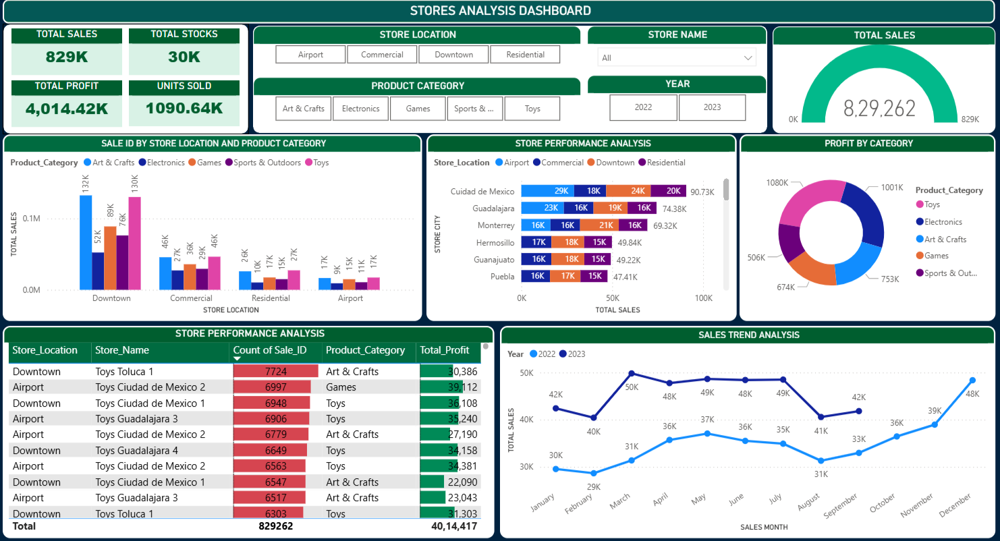

#  Stores Analysis Analysis Using SQL and Power BI

---

# 🏪 Stores Analysis – Capstone Project

## 📌 Project Overview
A newly opened **toy store chain** is performing reasonably well and wants to **analyze its sales, store performance, product demand, and inventory health** to improve overall business performance.

This capstone project focuses on analyzing historical data using **SQL** and visualizing insights through an **interactive Power BI dashboard** to support data-driven decision-making.

 
---

## 📊 Business Objective
The store management aims to:
- Understand **sales trends** across time, stores, and locations
- Identify **top-performing and underperforming stores**
- Analyze **product and category-level performance**
- Monitor **inventory health** to avoid overstocking or shortages

---

## 🗂️ Datasets Used
The analysis is based on **four main datasets**:

1. **Sales** – Transaction-level sales data  
2. **Stores** – Store details including location and store name  
3. **Products** – Product and category information  
4. **Inventory** – Inventory levels by store and product  

---

## 🛠️ Tools & Technologies
- **SQL** – Data cleaning, joins, aggregations, and analysis  
- **Power BI** – Interactive dashboard creation and visualization  
- **Excel / CSV** – Source data format  

---

## 🔍 Key Analysis Performed

### 1️⃣ Sales Trend Analysis
- Analyzed **monthly sales trends** across all stores  
- Compared performance for **both years (2022 & 2023)**  
- Evaluated sales behavior across different **store locations**

**Insights:**
- Seasonal patterns observed in monthly sales  
- Overall sales growth trend from 2022 to 2023  

---

### 2️⃣ Store Performance Analysis
- Identified **top 5 and bottom 5 performing stores** using a single SQL query  
- Analyzed **sales distribution by store location**
- Evaluated whether **store location impacts sales performance**

**Insights:**
- Downtown and Commercial locations outperform Residential and Airport stores  
- Certain stores consistently drive higher revenue regardless of location  

---

### 3️⃣ Product Performance Analysis
- Studied the **relationship between products and stores**
- Identified **high-demand product categories**
- Determined whether any category **outshines the rest**

**Insights:**
- **Toys and Electronics** emerged as the most demanded categories  
- Some products perform consistently well across all locations  

---

### 4️⃣ Inventory Health Analysis
- Calculated **average inventory levels** by store and product  
- Identified potential **overstocking and understocking issues**

**Insights:**
- Inventory levels vary significantly across stores  
- Scope for better inventory optimization based on sales demand  

---

## 📈 Power BI Dashboard
An interactive **Power BI dashboard** was created to visualize:
- Total Sales, Profit, Units Sold, and Inventory  
- Sales trends by year and month  
- Store and location-wise performance  
- Product category contribution to profit  

---

## 📌 Key Outcomes
- Enabled management to identify **high-performing stores and products**
- Highlighted **location-based sales impact**
- Provided insights for **inventory optimization**
- Delivered a centralized dashboard for **business monitoring**

---

## 🚀 Future Enhancements
- Forecast sales using **time-series models**
- Implement **inventory optimization logic**
- Add customer-level analysis (if data becomes available)
- Automate ETL pipelines

---

## 👤 Author

**Mihir Patil**  
Data Science Capstone Project

---
